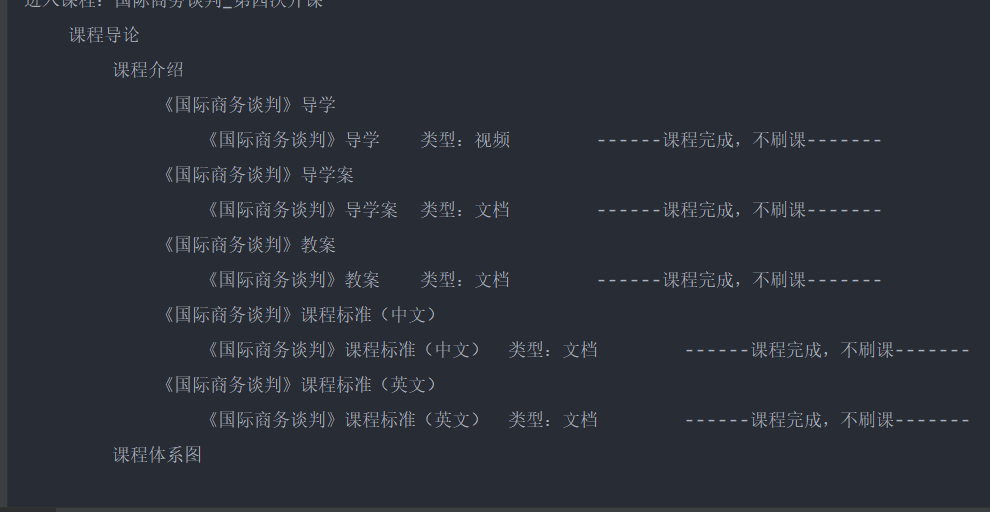

# 慕课网刷课脚本

> 基于`python<=3.9`

## 已完成功能

- [x] 项目初始化创建
- [x] 批量读取csv文件账号
- [x] 自动输入验证码
- [x] 自动刷课
- [ ] selenium 答题
- [ ] 多线程刷课
- [ ] 部署到服务器

## 安装

```git
1 -- 下载
git clone https://github.com/ranyong1997/sk.git

2 -- 安装
使用pip安装： `pip install -r requirements.txt`
清华镜像源安装：pip install -i https://pypi.tuna.tsinghua.edu.cn/simple -r requirements.txt

3 -- 运行
python manage.py
```

| 依赖包                        |
|----------------------------| 
| certifi==2021.10.8         | 
| charset-normalizer==2.0.12 | 
| ddddocr==1.4.3             | 
| flatbuffers==2.0           | 
| idna==3.3                  | 
| numpy==1.22.3              | 
| onnxruntime==1.11.0        | 
| opencv-python==4.5.5.64    | 
| Pillow==9.0.1              | 
| protobuf==3.19.4           | 
| requests==2.27.1           | 
| protobuf==3.19.4           | 
| urllib3==1.26.9            | 

## 效果
> 运行截图：

